A backtester is a piece of software used in financial/trading environments to test algorithmic trading strateiges on historical data before deploying them in real-world markets.

The architecture for this backtester is modeled after a [series of articles](https://www.quantstart.com/articles/Event-Driven-Backtesting-with-Python-Part-I/) on developing an event-driven backtester in Python by [Michael Halls Moore](https://github.com/mhallsmoore) on QuantStart. 

This beginner project aims to build to build an event-driven backtesting program using modern C++ features. It is also a means for me to develop my OOP and C++ skills. The broad framework of the program is visualized (with Claude's help) below:

```mermaid
flowchart LR
    %% ===== Data sources =====
    subgraph DATA["Data Source"]
        CSV[("Historical CSV(yfinance)")]
        FUTURE["WebSocket / Tick API(planned)"]:::planned
    end

    %% ===== Feed layer =====
    subgraph FEED["Data Feed"]
        DF["DataFeed"]:::abstract
        ECF["EagerCSVFeednext() → MarketEvent"]
        TF["TickFeed (planned)"]:::planned
        DF -.implements.-> ECF
        DF -.implements.-> TF
    end

    CSV --> ECF
    FUTURE -.-> TF

    %% ===== Event loop =====
    subgraph ENGINE["Engine (event loop)"]
        Q[/"Event Queue 
        std::variant<Market, Signal, Order, Fill>"/]
        DISPATCH{{"std::visit → handle(...)"}}
        Q --> DISPATCH
    end

    ECF -- MarketEvent --> Q

    %% ===== Handlers =====
    subgraph HANDLERS["Per-event handlers"]
        HM["handle(MarketEvent)
Update ctx & equity curve, run strategy"]
        HS["handle(SignalEvent)
        portfolio sizes order"]
        HO["handle(OrderEvent)
        broker fills"]
        HF["handle(FillEvent)
        portfolio applies"]
    end

    DISPATCH --> HM
    DISPATCH --> HS
    DISPATCH --> HO
    DISPATCH --> HF

    %% ===== Components used by handlers =====
    subgraph CORE["Engine state"]
        CTX[(MarketContext
        Per symbol price history)]
        STRAT["MACrossover : Strategy"]:::abstract
        PORT[(Portfolio, 
        Positions, Equity Curve)]
        BROK[Broker
        Slippage + commission]
    end

    HM --> CTX
    HM --> STRAT
    HS --> PORT
    HO --> BROK
    HF --> PORT

    %% ===== Re-emission back to queue =====
    STRAT -. SignalEvent .-> Q
    PORT -. OrderEvent .-> Q
    BROK -. FillEvent .-> Q

    %% ===== Output =====
    PORT --> ANALYTICS
    subgraph ANALYTICS["Analytics (post-run)"]
        REPORT["PerformanceReportreturns, Sharpe, drawdown,alpha vs buy-and-hold"]
        OUT_CONSOLE["Console output"]
        OUT_CSV["CSV output(planned)"]:::planned
        OUT_PLOTS["Plots(planned)"]:::planned
        REPORT --> OUT_CONSOLE
        REPORT -.-> OUT_CSV
        REPORT -.-> OUT_PLOTS
    end

    %% ===== Styling =====
    classDef planned stroke-dasharray: 5 5,fill:#2a2a2a,color:#aaa
    classDef abstract font-style:italic,fill:#1f3a5f
```

### Program Features:
* Event-driven architecture eliminates look-ahead bias and mimics real-time market data feed
    * Support for OHLCV Bar and Tick 
* Moving Average Crossover template strategy
* Analytics (Total return, CAGR, Sharpe, Max drawdown, etc)

### Modern C++ Features Used:
* std::variant (C++ 17) to represent the four distinct Event types (Market, Signal, Order, Fill)
    * std::visit (C++17) to handle correct code executation based on actual type of Event
    * Overloaded lambda as the argument to std::visit for appropriate function dispatch
* std::optional (C++17) as a type-safe way to represent absent tick/bar data.
* std::unique_ptr (C++11) to enable memory-safe runtime polymorphism on the pure virtual Strategy and DataFeed classes
* std::chrono library (C++11) enables type-safe, convenient, and robust representation of market data timestamps.

### Features currently working on:
- Python scripting to enable user-input fetching of yfinance OHLCV data
- Make CSV data handler more robust
- Add support for multi-ticker strategies (pairs trading)
	- Refactor/improve analytics to support multi-ticker evaluation
- Add more basic template strategies
- Add support for backtest beginning at specified date
- Implement priority queue for multi-feed handling
- Output equity curve to CSV for easy plotting later
- Use constexpr more
- Add more analytics
	- Add unit tests for analytics
- WebSocket/live data to support large volumes of crypto tick data
	- Tackle concurrency

